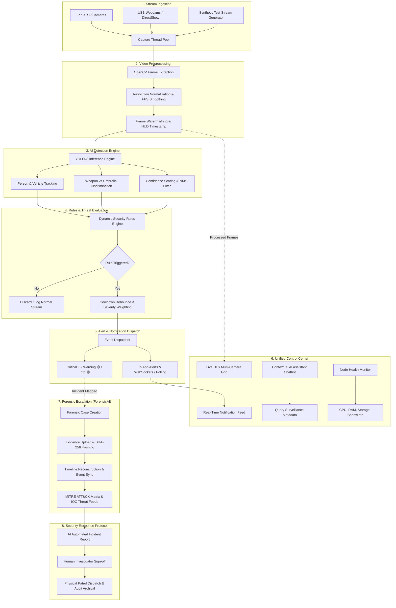

# 🛡️ CyberVision-AI: Next-Gen AI Surveillance & Digital Forensics

<div align="center">

[](https://nextjs.org/)
[](https://www.typescriptlang.org/)
[](https://tailwindcss.com/)
[](https://fastapi.tiangolo.com/)
[](https://python.org/)
[](https://opencv.org/)
[](https://github.com/ultralytics/ultralytics)
[](https://clerk.com/)
[](LICENSE)

**An autonomous, end-to-end intelligent security surveillance, threat detection, and digital forensics ecosystem.**

[Live Flow](#-end-to-end-project-flow) • [Features](#-core-features) • [Architecture](#-system-architecture) • [Getting Started](#-getting-started) • [API Reference](#-api-endpoints) • [ForensicAI](#-forensicai-investigation-suite)

</div>

---

## 🌟 Executive Overview

In conventional security environments, human operators are overwhelmed by dozens or hundreds of passive camera feeds, leading to missed security breaches, slow response times, and fragmented post-incident investigations.

**CyberVision-AI** transforms passive video monitoring into an active, proactive intelligence network. Built with **Next.js 13.5**, **FastAPI**, **YOLOv8**, and an integrated **ForensicAI** suite, CyberVision-AI covers the entire lifecycle of physical and digital security:

1. **Continuous Video Ingestion:** Multi-threaded capture from IP/RTSP streams, webcams, and synthetic feeds.
2. **Real-Time Edge Computer Vision:** Sub-100ms object detection, crowd density calculation, and weapon vs. benign object discrimination.
3. **Automated Security Rules Engine:** Instant evaluation of zone intrusions, loitering, and perimeter violations.
4. **Actionable Alerts & Command Center:** Live notification dispatch, low-latency streaming, and AI-assisted conversational log querying.
5. **Digital Forensics & Chain-of-Custody:** Post-incident timeline reconstruction, SHA-256 evidence hashing, MITRE ATT&CK correlation, and automated case reporting.

---

## 🔄 End-to-End Project Flow

CyberVision-AI is architected around an **8-stage continuous intelligence and response pipeline**:



### Detailed Pipeline Breakdown

| Step | Component | Description | Technologies |
| :--- | :--- | :--- | :--- |
| **1. Stream Ingestion** | `camera_manager.py` | Multi-threaded frame acquisition for RTSP feeds, USB webcams, and synthetic HUD fallback streams. | `cv2.VideoCapture`, Python threading |
| **2. Preprocessing** | `camera_manager.py` | Frame decoding, dynamic FPS calculation, DirectShow acceleration on Windows, and timestamp watermarking. | OpenCV, NumPy |
| **3. AI Inference** | `detector.py` | Real-time object identification, bounding box generation, and weapon discrimination using fine-tuned synthetic dataset. | Ultralytics YOLOv8, PyTorch |
| **4. Rules Engine** | `rules.py` / `rulesService.ts` | Evaluates live detections against security policies (restricted zone intrusion, unauthorized vehicles, after-hours presence). | Python, JSON schema, TypeScript |
| **5. Alert Engine** | `notifications.py` | Assigns priority tiers (`critical`, `warning`, `info`, `success`), applies 45s alert cooldown debounce, and notifies users. | REST API, SSE/Sockets |
| **6. Control Room** | `app/dashboard` | Multi-camera video feeds, interactive GPS maps, AI Assistant for natural-language log inspection, and server health telemetry. | Next.js 13.5, HLS.js, Recharts |
| **7. Digital Forensics** | `ForensicAI/` | Tamper-proof evidence capture, cryptographic SHA-256 verification, unified incident timelines, and MITRE ATT&CK mapping. | React 18, Node.js, Express, MongoDB |
| **8. Response & Action** | Platform Workflows | Incident export to PDF, automated security notifications, patrol dispatching, and audit logging. | PDFKit, REST endpoints |

---

## ✨ Core Features

### 🎥 Live Video Monitoring & Camera Management
- **Multi-Camera Grid:** Monitor multiple CCTV cameras simultaneously with low-latency HLS video playback.
- **Dynamic Camera Configuration:** Add, edit, or remove RTSP endpoints, USB webcams, or synthetic simulation channels.
- **GPS Geolocation Mapping:** Real-time interactive positioning of camera hardware with coverage radiuses.
- **Fail-Safe Synthetic Feed:** Automatic fallback to an animated high-tech radar HUD stream when physical cameras disconnect, guaranteeing uninterrupted testing.

### 🧠 Edge AI Detection & Weapon Discrimination
- **YOLOv8 Powered Detection:** Out-of-the-box identification of people, vehicles, backpacks, and perimeter anomalies.
- **Weapon vs. Umbrella Dataset (`Simuletic_Weapon_Umbrella_Dataset`):** Custom synthetic training dataset tackling one of surveillance's hardest false-positive challenges—distinguishing rifles and long guns from closed umbrellas.
- **Debounced Rule Execution:** Smart cooldown timers avoid alert spamming during prolonged detections.

### 🤖 Contextual AI Assistant
- Natural language query interface powered by FastAPI (`backend/api/ai_assistant.py`).
- Security operators can ask questions directly in plain English:
  - *"How many people were detected at the Front Gate in the last hour?"*
  - *"Are there any active critical security breaches?"*
  - *"Show me all vehicle detections across perimeter cameras."*

### 🚨 Alert & Notification Hub
- Color-coded severity indicators (🔴 Critical, 🟡 Warning, 🟢 Info, 🔵 Success).
- One-click acknowledgment, mark-as-read, and filtering by camera, severity, or date range.
- Live system audit trail for security compliance and incident reviews.

### 🏥 System & Node Health Diagnostics
- Live telemetry tracking CPU load, memory utilization, disk space, and network bandwidth.
- Status verification for camera connectivity, database storage, and AI inference latency.

### 🔬 Integrated Digital Forensics Platform (`ForensicAI`)
- **Strict Chain of Custody:** Automatic SHA-256 cryptographic hashing on evidence upload (LOG, PCAP, EVTX, CSV, images).
- **Unified Timeline Reconstruction:** Chronological cross-correlation between CCTV video timestamps and server log events.
- **Threat Intelligence (IOCs):** Live integration with AbuseIPDB and VirusTotal to check suspicious IPs and file hashes.
- **MITRE ATT&CK Matrix:** Automatic alignment of observed threat patterns with attacker tactics and techniques.
- **AI Investigation Reports:** Automated drafting of forensic incident summaries with Human-in-the-Loop review.

---

## 🏗️ System Architecture

CyberVision-AI is organized as a decoupled, high-performance monorepo:

```
CyberVision-AI/
├── app/                                 # Next.js 13.5 App Router (Frontend)
│   ├── dashboard/                       # Authenticated Security Dashboard
│   │   ├── page.tsx                     # Main Dashboard Overview
│   │   ├── forensics/                   # Integrated Digital Forensics Dashboard
│   │   ├── cameras/                     # Live Multi-Camera Feeds & Management
│   │   ├── notifications/               # Alert Dispatch & History Center
│   │   ├── health/                      # Node System Health Monitoring
│   │   ├── ai-assistant/                # Natural Language Video Copilot
│   │   └── settings/                    # Security Rules & General Preferences
│   ├── landing/                         # Product Showcase & Architecture Visualizer
│   ├── sign-in/ & sign-up/              # Clerk Authentication Pages
│   └── layout.tsx                       # Root Layout & Theme Providers
│
├── backend/                             # AI & Forensic Backend Systems
│   ├── api/                             # FastAPI Surveillance REST Endpoints
│   ├── data/                            # Persistent JSON Storage (Cameras, Rules, Logs)
│   ├── services/                        # Camera Streaming & YOLO Detection Services
│   ├── forensics/                       # ForensicAI Engine (Express + MongoDB + Evidence Vault)
│   ├── main.py                          # FastAPI Application Factory
│   └── run_backend.py                   # Uvicorn Server Runner (Port 8000)
│
├── frontend/                            # Standalone Modular Client Engines
│   └── forensics/                       # Forensic Investigation React Studio (Port 5173)
│
├── components/                          # Reusable UI Component Library
│   ├── landing/                         # Animated Landing Page & Pipeline Flow
│   ├── layout/                          # AppShell, Header & Sidebar Navigation
│   ├── auth/                            # Authentication Guards & Modals
│   └── ui/                              # Radix UI + Tailwind Design System
│
├── lib/
│   ├── data/
│   │   └── Simuletic_Weapon_Umbrella_Dataset/  # Synthetic YOLO Dataset (Images + Labels)
│   └── services/                        # Frontend API Clients & Services
│
├── run_backend.bat                      # Windows One-Click Backend Launcher
├── package.json                         # Node.js Dependencies & NPM Scripts
└── requirements.txt                     # Python Dependencies (backend/)
```

---

## 🚀 Getting Started

### Prerequisites

Ensure the following runtimes and tools are installed on your workstation:
- **Node.js**: v18.0.0 or higher ([Download](https://nodejs.org/))
- **Python**: v3.8 to v3.12 ([Download](https://python.org/))
- **Git**: ([Download](https://git-scm.com/))
- *(Optional for GPU acceleration)*: NVIDIA CUDA Toolkit & cuDNN for PyTorch

---

### Step 1: Clone the Repository

```bash
git clone https://github.com/adinahawaldar/CyberVision-AI.git
cd CyberVision-AI
```

---

### Step 2: Configure Environment Variables

Copy the example environment template:

```bash
cp .env.example .env.local
```

Edit `.env.local` with your configuration:

```env
# Clerk Authentication (https://dashboard.clerk.com)
NEXT_PUBLIC_CLERK_PUBLISHABLE_KEY=pk_test_your_key_here
CLERK_SECRET_KEY=sk_test_your_key_here

# Clerk Route Paths
NEXT_PUBLIC_CLERK_SIGN_IN_URL=/sign-in
NEXT_PUBLIC_CLERK_SIGN_UP_URL=/sign-up
NEXT_PUBLIC_CLERK_AFTER_SIGN_IN_URL=/dashboard
NEXT_PUBLIC_CLERK_AFTER_SIGN_UP_URL=/dashboard

# Backend API URL
NEXT_PUBLIC_API_URL=http://localhost:8000
```

> **Note:** If Clerk credentials are not configured, the system gracefully falls back to administrative session mode with default credentials: `admin` / `admin`.

---

### Step 3: Launch the Python AI Backend

#### Option A: One-Click Batch Script (Windows)
Double-click `run_backend.bat` in the root directory.

#### Option B: Terminal Setup
```bash
# 1. (Recommended) Create and activate virtual environment
python -m venv venv

# Windows:
venv\Scripts\activate
# macOS / Linux:
source venv/bin/activate

# 2. Install dependencies
pip install -r backend/requirements.txt

# 3. Start the FastAPI Engine
python backend/run_backend.py
```

The backend engine will start at **`http://localhost:8000`**.  
Interactive Swagger documentation is available at **`http://localhost:8000/docs`**.

---

### Step 4: Launch the Next.js Frontend

Open a new terminal window in the project root:

```bash
# 1. Install frontend dependencies
npm install

# 2. Run the Next.js development server
npm run dev
```

Open your browser and navigate to **`http://localhost:3000`**.

---

## 🔬 ForensicAI Investigation Suite

CyberVision-AI features a seamlessly integrated Digital Forensics Dashboard right inside the unified interface at [`/dashboard/forensics`](http://localhost:3000/dashboard/forensics).

To run the dedicated Forensic Engine services:

```bash
# 1. Start Forensics Express Backend (Port 5000)
npm run forensics:backend

# 2. (Optional) Launch Standalone Forensics Studio (Port 5173)
npm run forensics:frontend
```

Directly within CyberVision-AI, security investigators can create case files, verify cryptographic SHA-256 evidence hashes, synchronize CCTV timestamps with server logs, map attack vectors to MITRE ATT&CK tactics, and evaluate threat intelligence (IOCs) from AbuseIPDB & VirusTotal.

---

## 🌐 API Endpoints

The FastAPI backend exposes comprehensive RESTful and streaming endpoints:

### 📹 Video & Streaming (`/api/v1/streaming`)
| Method | Endpoint | Description |
| :--- | :--- | :--- |
| `GET` | `/api/v1/streaming/` | List all currently active camera streams |
| `GET` | `/api/v1/streaming/stream-urls` | Get playback stream URLs for user's cameras |
| `POST` | `/api/v1/streaming/start/{camera_id}` | Start live stream capture and YOLO detection for a camera |
| `POST` | `/api/v1/streaming/stop/{camera_id}` | Stop camera stream capture thread |
| `GET` | `/api/v1/streaming/live/{camera_id}` | MJPEG live video stream feed |

### 🎥 Camera Management (`/api/v1/cameras`)
| Method | Endpoint | Description |
| :--- | :--- | :--- |
| `GET` | `/api/v1/cameras/` | Retrieve all registered cameras |
| `POST` | `/api/v1/cameras/` | Register a new camera (RTSP, webcam, or synthetic) |
| `PUT` | `/api/v1/cameras/{id}` | Update camera details, coordinates, or enabled rules |
| `DELETE` | `/api/v1/cameras/{id}` | Remove a camera from the system |

### 🚨 Rules & Notifications (`/api/v1/rules`, `/api/v1/notifications`)
| Method | Endpoint | Description |
| :--- | :--- | :--- |
| `GET` | `/api/v1/rules/` | Fetch active security detection rules |
| `POST` | `/api/v1/rules/` | Create a new automated security trigger |
| `GET` | `/api/v1/notifications/` | Retrieve incident alert logs (filtered by severity/date) |
| `PUT` | `/api/v1/notifications/{id}/read` | Mark an alert notification as acknowledged/read |

### 🤖 AI Contextual Assistant (`/api/v1/ai-assistant`)
| Method | Endpoint | Description |
| :--- | :--- | :--- |
| `POST` | `/api/v1/ai-assistant/query` | Natural language query on live detections and event logs |
| `GET` | `/api/v1/health/` | Node telemetry: CPU, RAM, disk, and network stats |

---

## 🛠️ Technology Stack Summary

| Layer | Technologies |
| :--- | :--- |
| **Frontend Framework** | Next.js 13.5 (App Router), React 18, TypeScript |
| **Styling & Animation** | Tailwind CSS 3.3, Framer Motion, Radix UI Primitives, Lucide Icons |
| **Video Playback** | HLS.js, HTML5 Canvas, OpenCV MJPEG Streaming |
| **Data Visualization** | Recharts (Live analytics, uptime graphs, detection metrics) |
| **AI Backend** | Python FastAPI, Uvicorn, Pydantic, psutil |
| **Computer Vision** | OpenCV 4.8, Ultralytics YOLOv8 (`yolov8n.pt`), PyTorch, DirectShow |
| **Dataset** | Synthetic Weapon vs. Umbrella YOLO detection dataset |
| **Authentication** | Clerk Authentication (`@clerk/nextjs`) with fallback local admin RBAC |
| **Forensics Platform** | React 18, Vite 6, Node.js, Express, MongoDB, Mongoose, Redis |

---

## 🤝 Contributing

Contributions are welcome! Please follow this workflow:

1. **Fork** the repository.
2. **Create a feature branch:**
   ```bash
   git checkout -b feat/your-feature-name
   ```
3. **Commit your changes using Conventional Commits:**
   ```bash
   git commit -m "feat(streaming): optimize frame buffer for RTSP streams"
   ```
4. **Push to your branch:**
   ```bash
   git push origin feat/your-feature-name
   ```
5. **Open a Pull Request** describing your additions or fixes.

---

## 📄 License

This project is licensed under the **MIT License** — see the [LICENSE](LICENSE) file for full details.

---

<div align="center">

**Built with pride for high-reliability public safety & automated threat intelligence.**

[Back to Top ↑](#-cybervision-ai-next-gen-ai-surveillance--digital-forensics)

</div>
